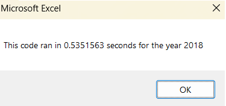
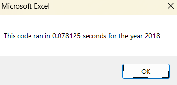

# Stock-Analysis

## Overview of Project
The purpose of this analysis was to make a dataset that compiled a client’s stock market data. Although the code worked, this project specifically will further improve the code for the client by refactoring the code.  Below are the results.

## Results
### Previous Sample Code and Timed Results.
'5) loop through rows in the data
       Sheets(yearValue).Activate
       For j = 2 To RowCount
          
          '5a) Get total volume for current ticker
           If Cells(j, 1).Value = ticker Then
               totalVolume = totalVolume + Cells(j, 8).Value
           End If
           
           '5b) get starting price for current ticker
           If Cells(j - 1, 1).Value <> ticker And Cells(j, 1).Value = ticker Then

               startingPrice = Cells(j, 6).Value
           End If
  
  '5c) get ending price for current ticker
           If Cells(j + 1, 1).Value <> ticker And Cells(j, 1).Value = ticker Then
               endingPrice = Cells(j, 6).Value
           End If

### Refactored Sample Code And Timed Results 

'1a) Create a ticker Index
    
    tickerIndex = 0

    '1b) Create three output arrays

    Dim tickerVolumes(12) As Long
    Dim tickerStartingPrices(12) As Single
    Dim tickerEndingPrices(12) As Single
    
'2a) Create a for loop to initialize the tickerVolumes to zero
    For i = 0 To 11
    tickerVolumes(i) = 0
    Next i
   
 '2b) Loop over all the rows in the spreadsheet.
    Worksheets(yearValue).Activate
    
    For i = 2 To RowCount
        '3a) Increase volume for current ticker
        tickerVolumes(tickerIndex) = tickerVolumes(tickerIndex) + Cells(i, 8).Value
        
'3b) Check if the current row is the first row with the selected tickerIndex.
        If Cells(i, 1).Value = tickers(tickerIndex) And Cells(i - 1, 1).Value <> tickers(tickerIndex) Then
        tickerStartingPrices(tickerIndex) = Cells(i, 6).Value
     
        End If
       
 '3c) check if the current row is the last row with the selected ticker
         'If the next row's ticker doesn't match, increase the tickerIndex.
        If Cells(i, 1).Value = tickers(tickerIndex) And Cells(i + 1, 1).Value <> tickers(tickerIndex) Then
        tickerEndingPrices(tickerIndex) = Cells(i, 6).Value
        End If
           
 '3d Increase the tickerIndex.
            If Cells(i + 1, 1).Value <> Cells(i, 1).Value Then
            tickerIndex = tickerIndex + 1
            
            End If

  
##Summary

